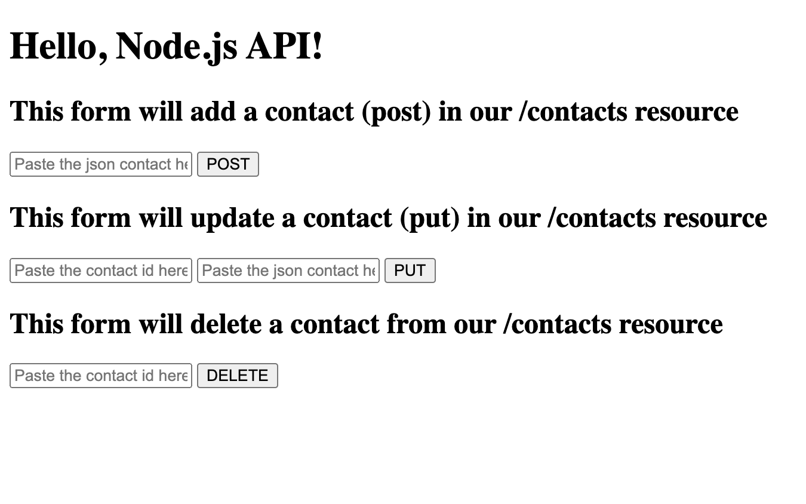

# Node.js API to do CRUD operations on a contacts database

## To start the server

Simply run the following terminal command from the project directory

```shell
npm run dev
```

## After you start the server, you can check out the api with a simple UI

Go to `http://localhost:3000/` on your browser, and the following UI should show up:



The first POST form requires you to enter the contact JSON, and after you press 'POST,' the record will be added to the db.

To check the record(s) you just added, type in `http://localhost:3000/contacts` on the browser, and you should see all of the records in the DB.

You can grab the `_id` attribute from one of the records, and use it to make another API call to get only that individual record: `http://localhost:3000/contacts/{copied _id}`.

Back to the simple UI, the second PUT form to update a record requires you to enter the updated contact JSON and an existing ID. After you press 'PUT,' the record will be updated in the db.

Lastly, to delete the record we have been working with, simply go back to the UI and enter the ID in the form. When you press 'DELETE,' the record will be removed from the database.

## Checking on records in the database

If you want to check on the database, simply check the `database` file at the root of the project. I used `neDB` to preform the various CRUD operations which stores the data in that file.

## Running the tests

To run the tests. Simply go to the command line and type in:

```shell
npm run test
```

This will run the end to end tests I wrote using `jest` and `supertest`.
